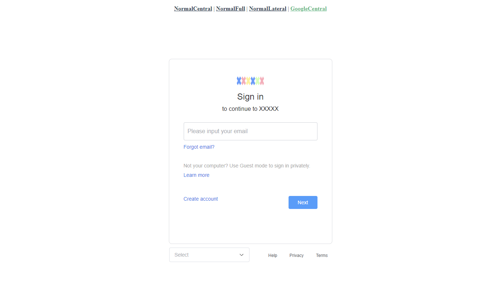

# customizable-login-component-library

---
[//]: # (# License)
[//]: # ( [MIT]&#40;https://github.com/Kawamiya/customizable-login-component-library/blob/main/LICENSE&#41;)


[](https://codecov.io/github/Kawamiya/customizable-login-component-library)


## Overview

---
A login component library for vue3



### Installation
```angular2html
npm install customizable-login-component-library
```
### Usage
```angular2html
import {GoogleCentral} from 'customizable-login-component-library'
```