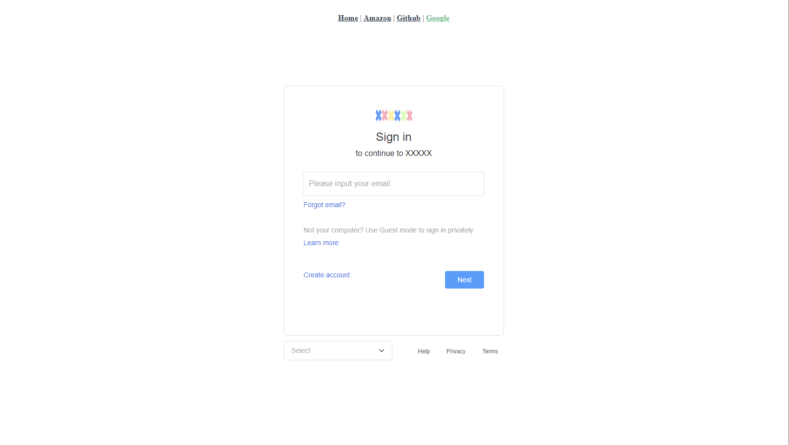
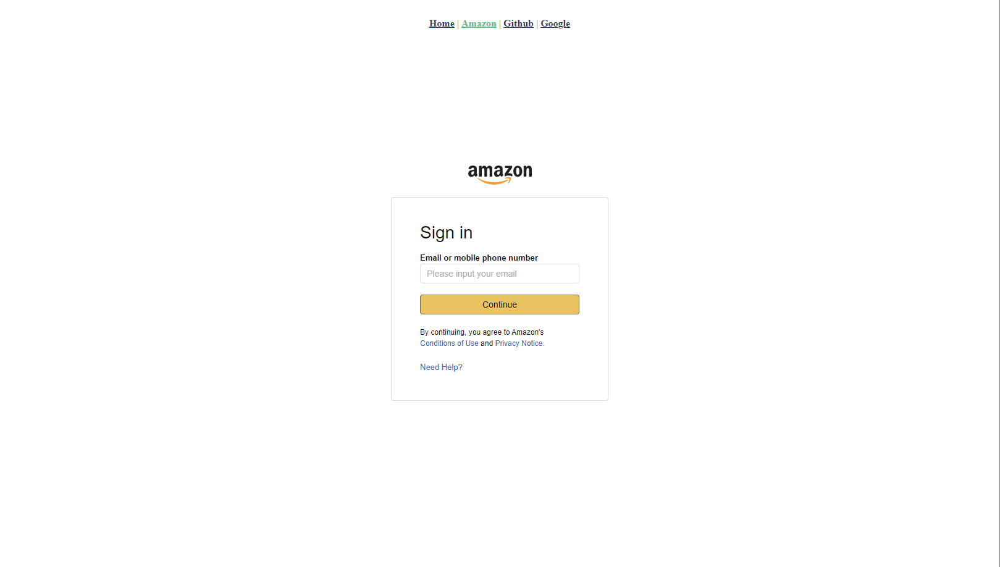
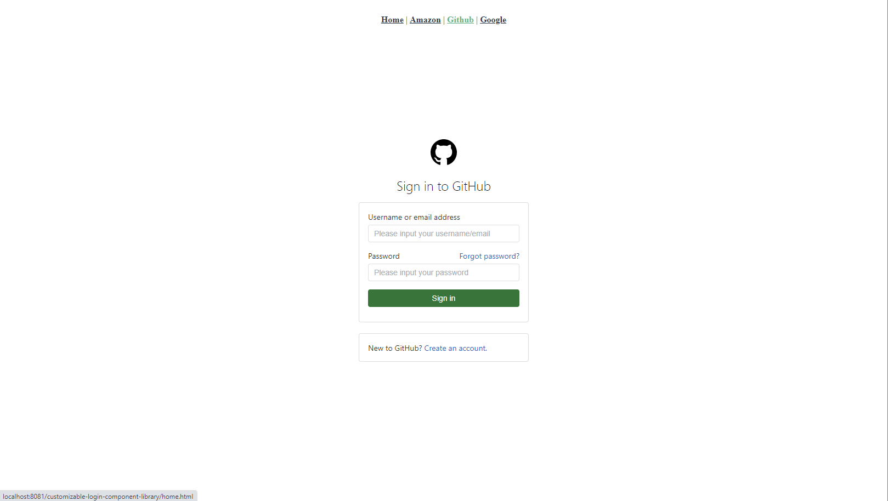
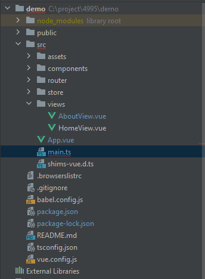
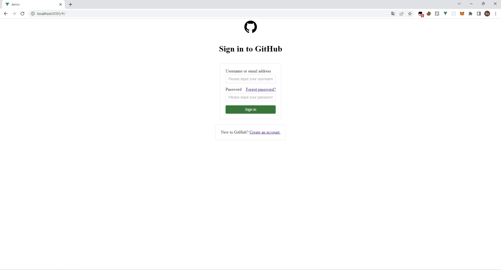

# customizable-login-component-library

---
[//]: # (# License)
[//]: # ( [MIT]&#40;https://github.com/Kawamiya/customizable-login-component-library/blob/main/LICENSE&#41;)


[](https://codecov.io/github/Kawamiya/customizable-login-component-library)

[](https://www.npmjs.com/package/customizable-login-component-library)
[](https://kawamiya.github.io/customizable-login-component-library/home.html)
## Overview

---
A login component library for vue3.

#### Have you ever designed login pages over and over again, even though they don't change much?
#### Do you despair of your aesthetics and can't design a login page to your liking?

If you think so, then this project is definitely for you.

In this project, I designed three login components out of the box by referring to login sites of well-known companies.

The main purpose of this library is to help developers omit repetitive login page development or provide a login page template.

The project provides the following login page:





Of course, I provide the source code in github, you can refer to this login page for modification, all the login page styles are concentrated inside a single vue file, no extra css settings are needed.

Through element-ui's Carousel component, I have implemented a multi-layer form, which can support some complex login operations, while if you want to increase the number of layers of the form (such as adding CAPTCHA or SMS verification), you can refer to the usage of the Carousel component in eelement-ui to modify and add.

### Installation
```angular2html
npm install customizable-login-component-library
```
### Usage

First of all, this project is based on vue and element-ui development, so the library must be used in combination with them.

Next let's start by creating a new vue project to understand how to use this library.

#### create a new project with vue/cli
you can create a vue project with webstorm

or use vue/cli to init a project
```angular2html
vue create <project-name>
```
if you use vue/cli to create a new project, the new project should be like:


#### install element-ui
please refer to official document of element-ui to install it.

#### install this library
```angular2html
npm install customizable-login-component-library
```
#### modify main.ts/main.js to use this library
the main.ts/main.js should be like:
```angular2html
import { createApp } from "vue";
import App from "./App.vue";
import router from "./router";
import store from "./store";
import ElementPlus from 'element-plus'
import 'element-plus/dist/index.css'

// @ts-ignore
import CLCL from './packages/index.js'
createApp(App)
  .use(ElementPlus)
  .use(store)
  .use(router)
  .use(CLCL)
  .mount("#app");
```

At this point we have all the settings ready, so we can use the library directly.

#### use component of this library

modify App.vue
```angular2html
<template>
  <github-central/>
</template>
<style>
  #app{
    display: flex;
    justify-content: center;
    align-items: center;
    flex-direction: column;
  }
</style>
```

If you have done all of the above without any problems, you should see the following screen:

